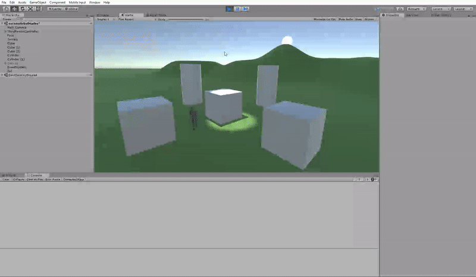
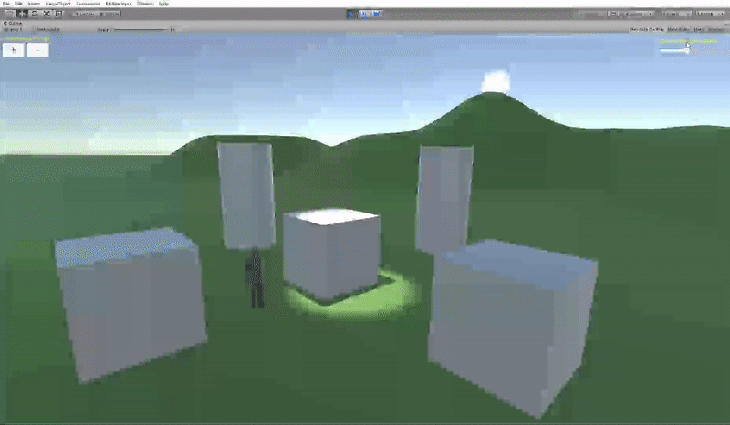

# Prácticas Unity

Grupo:
- Alejandro León Fernández
- Sara Revilla Báez
- David de León Rodríguez

## Delegados y Eventos

- Crear un escenario básico para la escena del proyecto para la evaluación final.
- Agregar dos tipos de GameObject de los que haya varias instancias en la escena: **cubos (tipo A) y cilindros (tipo B)**.
- Implementar un controlador de escena usando el patrón delegado que gestione las siguientes acciones: **GameController.cs**
	- Si el jugador choca con un objeto de tipo A se incrementa su poder: **CrashControl.cs**
	- Si el jugador choca con objetos de tipo B, todos los de ese tipo sufrirán alguna transformación o algún cambio en su apariencia y decrementarán el poder del jugador: **CambiarApariencia.cs**
- Incorporar un elemento que sirva para encender o apagar un foco utilizando el teclado (**I/O**): **SwitchLight.cs**

Los scripts correspondientes se encuentran en el directorio `delegados_y_eventos`.

## Interfaz de Usuario

Agregar un objeto Canvas para generar una interfaz de usuario que permita las siguientes acciones en la escena:
- Aumentar o disminuir la intensidad de una de las fuentes de luz (sol): **CambiarLuminosidad.cs**
- Aumentar o disminuir el tamaño de los objetos A (cubos) de la escena: **CambiarTamaño.cs**

Los scripts correspondientes se encuentran en el directorio `interfaz`.

